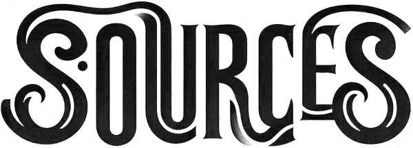
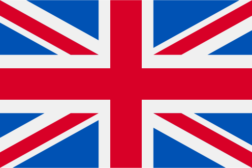
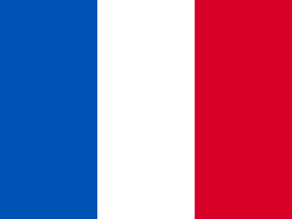
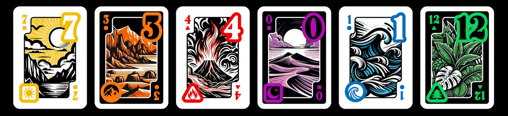
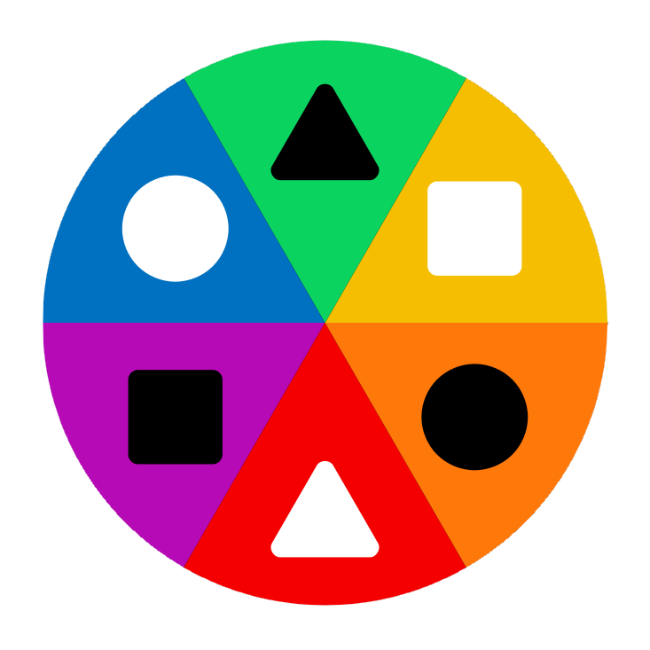

<a name="sources"></a>
<p align="center">
  <picture>
    <source media="(prefers-color-scheme: dark)" srcset="assets/sources_dark_theme.png" height="100px" />
    
  </picture>
  <br />
  c a r t e s &nbsp; & &nbsp; j e u x
</p>

<p align="center">
  <a href="https://github.com/Polyhedr/Sources/tree/english?tab=readme-ov-file#sources"></a>
  &nbsp;&nbsp;&nbsp;&nbsp;&nbsp;
  <a href="https://github.com/Polyhedr/Sources/tree/fran%C3%A7ais?tab=readme-ov-file#sources"></a>
</p>

<h6 align="center">
Sources est un jeu de cartes innovant où chaque partie est unique : il te suffit de choisir une carte Règle pour découvrir une nouvelle façon de jouer. 
Et ce n’est pas tout : le jeu est conçu pour évoluer grâce à sa communauté. Tu peux modifier les règles existantes ou en créer de nouvelles. On t'explique tout ici...
</h6>


## Les cartes Sources 🃏🎴  
**Sources** contient 78 cartes, réparties en **13 valeurs** (de 0 à 12) et **6 couleurs** (jaune, orange, rouge, violet, bleu, et vert). Sur le plan esthétique, chaque couleur est associée à un motif distinct : par exemple, le rouge est symbolisé par le feu, le bleu par l’eau, etc.

<p align="center">

</p>

Les 6 couleurs sont organisées selon :  
- **Trois symboles** :  
  - **Carré** : jaune et violet.  
  - **Rond** : orange et bleu.
  - **Triangle** : rouge et vert.  
- **Deux thèmes** :  
  - **Claire** : jaune, rouge et bleu.  
  - **Sombre** : orange, violet et vert.  

Ce système, inspiré des cartes à jouer traditionnelles (rouge/noir avec ♥️♠️♦️♣️), assure une compatibilité complète avec les jeux classiques tout en ouvrant la voie à la création de règles plus élaborées.

<p align="center">

</p>

Les couleurs des cartes sont organisées sur un **cercle chromatique**, où chaque couleur est reliée à deux voisines naturelles, par exemple, **orange** est adjacent à **rouge** et **jaune**. Cette organisation peut être utilisée dans les règles pour exploiter des mécaniques basées sur la proximité des couleurs. Le cercle chromatique est conçu de manière à respecter l’alternance des thèmes (clair/sombre) et des symboles (carré, rond, triangle), avec deux couleurs opposées partageant le même symbole. 

## Les jeux Sources 🎮
Explore ici la collection complète des jeux Sources.

|README du jeu|Carte Règle|Durée|Âge|Joueurs|Cartes|
|-------------|:---------:|-----|---|-------|------|
|**[Deux Tours](https://github.com/Polyhedr/Sources/tree/fran%C3%A7ais/rules/Deux_Tours#deux-tours)**|[](https://github.com/Polyhedr/Sources/tree/fran%C3%A7ais/rules/Deux_Tours/Deux_Tours/rule.pdf)|20 min|10+|2-6|0-10 🟡🟠🔴🟣🔵🟢|
| **[Skyzone](https://github.com/Polyhedr/Sources/tree/fran%C3%A7ais/rules/Skyzone#skyzone)**|[](https://github.com/Polyhedr/Sources/tree/fran%C3%A7ais/rules/Skyzone/Skyzone/rule.pdf)|20 min|12+|2-3|0-10 🟡🟠🔴🟣|
| **[Skyzone shape](https://github.com/Polyhedr/Sources/tree/fran%C3%A7ais/rules/Skyzone#skyzone-shape)**|[](https://github.com/Polyhedr/Sources/tree/fran%C3%A7ais/rules/Skyzone/Skyzone_shape/rule.pdf)|20 min|12+|2-4|0-10 🟡🟠🔴🟣🔵🟢|
| **[Sup](https://github.com/Polyhedr/Sources/tree/fran%C3%A7ais/rules/Sup#sup)**|[](https://github.com/Polyhedr/Sources/tree/fran%C3%A7ais/rules/Sup/Sup/rule.pdf)|25 min|12+|2-6|1-12 🟡🟠🔴🟣🔵|
| **[Sup team](https://github.com/Polyhedr/Sources/tree/fran%C3%A7ais/rules/Sup#sup-team)**|[](https://github.com/Polyhedr/Sources/tree/fran%C3%A7ais/rules/Sup/Sup_team/rule.pdf)|25 min|12+|2-6|1-12 🟡🟠🔴🟣🔵|
| **[Unomytho](https://github.com/Polyhedr/Sources/tree/fran%C3%A7ais/rules/Unomytho#unomytho)**|[](https://github.com/Polyhedr/Sources/tree/fran%C3%A7ais/rules/Unomytho/Unomytho/rule.pdf)|20 min|6+|2-6|0-11 🟡🟠🔴🟣🔵🟢|
| **[Unomytho 1pile](https://github.com/Polyhedr/Sources/tree/fran%C3%A7ais/rules/Unomytho#unomytho-1pile)**|[](https://github.com/Polyhedr/Sources/tree/fran%C3%A7ais/rules/Unomytho/Unomytho_1pile/rule.pdf)|20 min|6+|2-6|0-11 🟡🟠🔴🟣🔵🟢|

## Comment fonctionnent les cartes Règle ? 📄
Chaque règle de **Sources** est associée à une **carte Règle**, générée à partir du fichier **rule.tex** (en PDF via lualatex). La carte est recto-verso et comprend plusieurs éléments :

- **QR code** : un QR code (**qr-code.png**) qui redirige vers le fichier **README.md** associé à la règle. Ce fichier fournit des détails supplémentaires pour clarifier les règles si nécessaire.
- **Logo du jeu** : le logo du jeu (**logo_alpha.png**).
- **Indications sur le jeu** : âge limite, valeurs et couleurs des cartes nécessaires pour jouer, nombre de joueurs et durée moyenne d'une partie.
- **Résumé des règles** : un condensé des règles, souvent suffisant pour commencer à jouer.

## Dépendances
**Windows (avec [Chocolatey](https://community.chocolatey.org/)):**
```sh
choco install texlive imagemagick ghostscript
```
**Linux (avec apt):**
```sh
sudo apt-get install texlive imagemagick ghostscript
```

## Créer une nouvelle règle ✨
Envie d'ajouter une nouvelle règle à **Sources** ? Suis ces étapes pour contribuer :  
1. **Créer le fichier de règle** : Rédige un fichier **rule.tex** décrivant ta nouvelle règle.
2. **Ajouter un QR code** : Génère un QR code (**qr-code.png**) via [QRCode Monkey](https://www.qrcode-monkey.com/). Ce QR code doit rediriger vers un fichier **README.md** contenant :
   - Une explication détaillée de la règle.
   - Des exemples ou des conseils de jeu si nécessaire.
3. **Ajouter un logo** : Inclue un fichier **logo_alpha.png** pour représenter visuellement ta règle (1800x624 px).
4. **Générer la carte PDF** : Utilise **lualatex** pour transformer le fichier **rule.tex** en une carte recto-verso au format PDF.
5. **Soumettre ta règle** : Propose ta règle à la communauté en créant une pull request sur le dépôt **Sources**.

En cas de questions, n'hésite pas à ouvrir une issue pour discuter avec la communauté. 🚀

## Modifier une règle existante ✏️
Si tu souhaites modifier une règle existante, voici deux options :
1. **Ouvrir une issue** : Si tu as identifié un problème ou une amélioration à apporter, ouvre une issue pour en discuter avec la communauté. 🗣️
2. **Soumettre une pull request** : Modifie directement le fichier **rule.tex** ainsi que le **README.md** associé, puis soumets une pull request pour proposer tes changements. 🔧

## Autres jeux compatibles ♻️
Tu connais ou cherches un jeu déjà existant compatible avec **Sources** ? Cette section est faite pour toi ! 🔍  
Nous y répertorions les jeux compatibles avec **Sources**. Si tu connais un jeu compatible qui n’est pas encore dans cette liste, n’hésite pas à ouvrir une issue ou à soumettre une pull request ! 💡

|Jeu|Détails|
|-------------|-----------|
|[Mastermind](https://fr.wikipedia.org/wiki/Mastermind)|Le codeur sélectionne 4 cartes parmi les 24 premières cartes (0-3 des 6 couleurs) et conserve les 20 restantes face cachées. Ces cartes servent d'indices : "Correct mais mal placé" : carte posée horizontalement, face cachée, "Correct et bien placé" : carte posée verticalement, face cachée. Le nombre limité de cartes, comparé au Mastermind classique, ne pose pas de difficulté pour un joueur logique qui veille à la cohérence de ses tentatives.|
