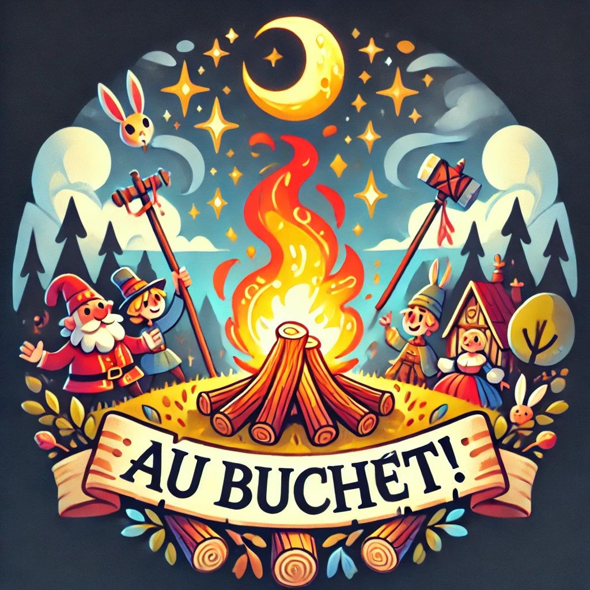

# Au Buchet !

## Rules

In this game, there is 2 teams/role : witch and villager, at the start of the game you will secretly receive your role, when your are playing you should never let someone else see the role cards.
- The goals for : 
    - **Villager** is to find the witch and burn them at the stake ! Make sure to save money in the chest to build a Purification Tower that make all villagers won.
    - **Witch**    is to hide within the villager and reduce the chest money ! Make sure to not get caught.
Player with the longest noze start the game (he is probably a witch).

### Installation

To distribute the role, take as much 🔵 cards as villagers needed and as much 🟣 cards as witch needed (see Rule table). Suffle the cards and distribute them hidden face. Each player keep their role secret until they burn or the game end.
From the deck remove the cards to match the **Rule Table**.
- And remove : 
    - 🟠 Orange : 0-1 and 6-12

Then from the remaining card, distribute 3 cards for each player. Players will have to pick a card at the end of their turn to alwais have 3 cards.

### Main loop

At their turn a player must play a card :
- Play in the chest: put the card hidden face on the chest pile and anonce what you inserted (you may lie)
- Play a fire/water/log card on someone else

Then the player pick another one in the deck, to have 3 cards.

then it's at the player on the right to play.

### Burning
When a player's burn value exceeds the thresholds, he enters a burning phase but he does not die immediately, the game continue until it is his turn. At it's turn if the burn value steel exeeds the thresholds he die. Note that at his turn, the player can play a water card on himself and remove a fire card, then the burn value does no more exceeds the thresholds he can continue to play.

### End Game
there is multiple ways to end the game:

- At their turn, a villager can decide to build the **Purification Tower**, the game stop immediatly and the player process to count the truth value of the chest, if the sum is above or equal Purification Tower Cost then the Villager won otherwise, the witch won.
- If there is as much villager as witch the witch won.
- If all the witch have burned, Villagers won.
- if there is no more cards in stack, the witch won.

### Cards
- Cards theme used as:
    - ⚪ Light: **+1** value
    - ⚫ Dark: **-1** value
- Cards colors used as:
    - 🔴 Red: Add fire to burn someone, if the sum of red cards is greater than or equal to the *Burn Value* or if the number for fire cards is 3 the player enter in a burning phase.
    - 🟢 Green: to place a log in front of someone, is required to start a fire
    - 🔵 Blue : Cancel any red cards
    - 🟠 Orange : Let you look at the 3 latest cards added to the chest. but you must suffle them before.

### Rule table
| nb Player | nb Witch | 🔴 Cards to keep | Burn Value | Purification Tower Cost |
|:-:|:-:|:-:|:-:|:-:|
| 3 | 1 | 0-10 | 10 | 6 |
| 4 | 1 | 0-12 | 10 | 7 |
| 5 | 1 | 0-12 | 10 | 10 |
| 6 | 2 | 0-12 | 10 | 8 |
| 7 | 2 | 0-12 | 10 | 13 |
| 8 | 2 | 0-12 | 10 | 15 |

Any resemblance to Traitre à Bord is fortuitous